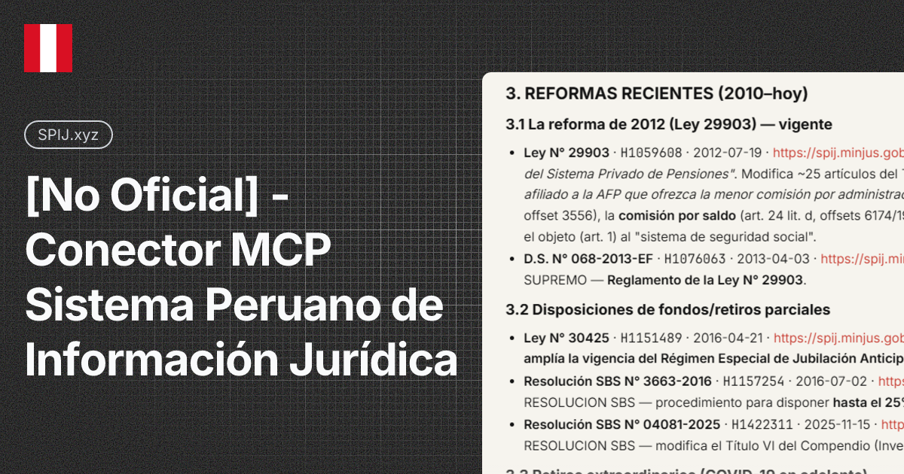

# spij-mcp




Servidor MCP **local** para buscar y leer el **SPIJ** — Sistema Peruano de
Información Jurídica (normas legales, resoluciones, jurisprudencia del
Tribunal Constitucional y más) — desde tu harness MCP.

> Herramienta **no oficial**: sin afiliación con MINJUS ni con el SPIJ.

| Aspecto | Detalle |
|---|---|
| Fuente de datos | [spij.minjus.gob.pe](https://spij.minjus.gob.pe/spij-ext-web/#/sidenav/resultado) (público) |
| Autenticación | Implícita: usa la misma sesión pública del sitio web y se renueva sola (JWT de 24 h) |
| Almacenamiento | **Ninguno** — el servidor nunca guarda archivos; devuelve contenido limpio |
| Transporte | stdio (Claude Desktop, Claude Code, agentes compatibles con MCP) |

## Instalación

### Opción A — Un click (sin terminal)

1. Descarga **`spij-mcp-0.6.2.mcpb`** desde [Releases](https://github.com/pipaacebedo/spij-mcp/releases).
2. Abre Claude Desktop → **Ajustes → Extensiones → Instalar desde archivo**.
3. Selecciona el `.mcpb` y listo.

> No requiere Python instalado: el instalador resuelve el runtime y las
> dependencias automáticamente (runtime UV de MCPB).

### Opción B — Manual (CLI y otros agentes)

Primero instala [uv](https://docs.astral.sh/uv/) si no lo tienes:

```powershell
# Windows (PowerShell)
irm https://astral.sh/uv/install.ps1 | iex
```

```bash
# macOS / Linux
curl -LsSf https://astral.sh/uv/install.sh | sh
```

(o `pip install uv` si prefieres).

Luego, en la carpeta del proyecto:

```bash
uv sync
```

Y añade a la configuración de servidores MCP de tu agente:

```json
{
  "mcpServers": {
    "spij": {
      "command": "uv",
      "args": ["--directory", "RUTA/spij-mcp-OSS", "run", "spij-mcp", "serve"]
    }
  }
}
```

El servidor envía sus instrucciones de uso por el handshake MCP: el agente
sabe cómo buscar y leer sin prompts adicionales.

## Tools

| Tool | Qué hace |
|---|---|
| `buscar_normas` | Búsqueda full-text con filtros (dispositivo, sector, agrupación, número, fechas) y paginación |
| `buscar_jurisprudencia` | Igual, para jurisprudencia; `organismo="TC"` filtra localmente por organismo emisor |
| `estructura_norma` | Índice de encabezados de una norma (TÍTULO, CAPÍTULO, Artículo N.) con offsets navegables |
| `buscar_en_norma` | Salta a las ocurrencias de una palabra o frase dentro de una norma |
| `detalle_norma` | Metadatos + texto plano de una norma por `id` (lectura por rangos) |
| `texto_completo` | Texto completo garantizado, incluido el acervo de suscriptores |
| `listar_filtros` | Valores exactos para los filtros (dispositivos, sectores, tomos, materias, agrupaciones) |

## Cómo se lee (4 niveles)

1. **Descubrir** — `buscar_normas` / `buscar_jurisprudencia`: cada resultado trae `id`, `url_web` y `sumilla`.
2. **Mapear** — `estructura_norma(id)`: índice de encabezados con offsets.
3. **Saltar** — `buscar_en_norma(id, texto)`: ocurrencias con offsets.
4. **Leer** — `texto_completo(id, offset, max_chars)`: lectura por rangos; `desde_final=True` lee la decisión de una sentencia directo.

Los offsets son consistentes entre tools: se puede empezar a leer justo donde interesa
sin traer textos completos de más.

## Notas de uso

- El buscador del SPIJ hace **AND implícito** con todas las palabras y no
  acepta comillas ni operadores OR/NOT. Acepta comodines de Lucene (`presupuest*`).
- Si una búsqueda da 0 resultados, la respuesta incluye `sugerencias` con
  conteos de consultas más cortas; si un número de norma no está indexado,
  la respuesta trae los documentos que lo mencionan.
- Los textos legales pueden ser extensos: la lectura progresiva (offsets)
  evita llenar el contexto con lo que no se necesita.

## Pruebas de concepto del servicio

El SPIJ es un servicio público de MINJUS. Este cliente lo consulta como lo
hace su propia interfaz web, sin abuso: cache local, concurrencia limitada
y re-autenticación automática.

## Aviso legal

- Proyecto independiente, **no oficial**, sin relación con MINJUS, el SPIJ
  ni ninguna entidad del Estado peruano.
- Sin garantía de disponibilidad del servicio upstream ni de exactitud de
  los textos; para uso jurídico serio, verifica siempre en la fuente oficial.
- La autoría normativa pertenece al Estado Peruano.

## Licencia

[Apache-2.0](LICENSE)
